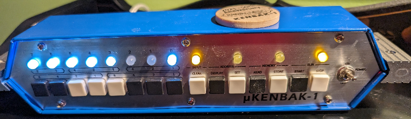

# microKENBAK-1 Compiler
Compiles a small language, **KBlang**, defined to simplify the programming of the microKENBAK-1 computer.

## Using the Compiler
### Command line arguments
The compiler requires the source file name to be supplied as the first argument on the command line. If that is the only argument, the generated machine code is written to the file **CompiledResult.ops**

An optional second argument can serve one of two purposes:

1. If the second parameter is `--ASHTML` then a program listing containing the source code and showing the generated machine instructions is written to a file with the same name as the source file but with the added suffix of **.html**

2. Otherwise, the second argument is taken as the name of the file to write the machine code to.

### Build and Run Using a Shell Script
Shell scripts are provided to build and run the compiler. These work on a Linux system with the Java Development Kit and BASH installed.

To build the compiler use this command: `./make-compiler.sh`

To run the compiler use this command: `./kb1-compile *source_code_file*`

For example: `./kb1-compile samples/CountUpandDown.kb1`

The resulting machine instructions will be printed on the screen. 

To write the machine code to a file, provide the output file name as a second argument: `./kb1-compile *source_code_file* *output_file*`

For example: `kb1-compile samples/Cylon.kb1 cylon.ops`

To write the program to an HTML file as a listing of inputs and outputs, use the **--ASHTML** argument.

For example: `kb1-compile samples/DrNim.kb1 --ASHTML`

The HTML file is written to the location of the source file and named with a **.html** suffix. In the above example, the output file would be `DrNim.kb1.html`

### Using Ant
If you have Ant installed (https://ant.apache.org/) you can use the following command to compile a program:

`ant -Dinput=path_to_source run`

For example, to compile the DrNim program:

`ant -Dinput=samples/DrNim.kb1 run'

The machine instructions are written to **CompiledResult.ops** which is suitable for serial upload into the microKENBAK-1

To write the HTML representation of the Calculator program, this would be the Ant command:

`ant -Dinput=samples/Calculator.kb1 runHtml

The resulting web page would be in **samples/Calculator.html**

To write the compiled machine instructions to a specific file, use the output directive. For example, to compile the Cylon program and write the instructions to the file cylon.txt, this would be the Ant command:

`ant -Dinput=samples/Cylon.kb1 -Doutput=cylon.txt run` 

#### Running the Unit Tests
A test suite is defined for the compiler, it is run using the command:

`ant test`

Both unit test and code coverage results are produced in the `generated` directory.

### Using Your IDE
Ensure the **src/config** and **src/java** directories are set as the source path and that the **lib** amd **test-lib** directories are on the classpath. Define the command line to include the path to the source file to compile as the first argument on the command line. The class to run is **us.daveread.microkenbak1.compiler.Compiler** 

## Language Design
KBlang is tightly tied to the microKENBAK-1's machine codes. Here is an example program, found as **samples/CountUp.kb1**,  to have the LEDs continuously display counting values from 0 to 255 with a 255 ms delay between updates of the LEDs:

---
	# Program to repeatedly count from 0 to 255, displaying each value on the LEDs

	# Set A and B for program delay syscall
	let a = 0377
	let b = 0200

	# Initialize X
	let x = 0

	# Top of loop to display counting on LEDs 
	label top
	add 1 to x
	memcopy x to display
	syscall
	goto top
---

The language description is found in **[documentation/LanguageSpecification.md](documentation/LanguageSpecification.md)** 

Example programs are found in the **samples** directory and **[videos of several sample programs running](https://www.youtube.com/playlist?list=PL6TXVZYCjsKYymB6kaxiJsRQTL8TwtUdY)** are on YouTube.

For information on the microKENBAK-1 computer kit see: [https://adwaterandstir.com/product/kenbak-1/](https://adwaterandstir.com/product/kenbak-1/)
